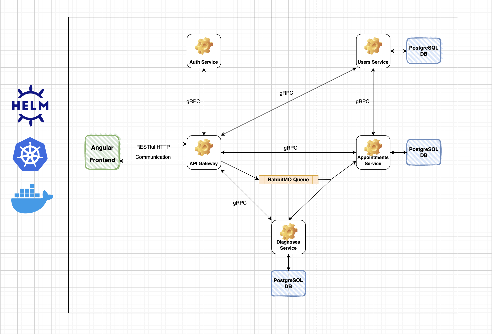

# Medical Record System

## Overview

This is a medical record system that allows doctors to manage their patients' medical records.

This project is built as a part of the "CSCB869 Java Web Services" course at the New Bulgarian University.

## Technical Overview

The project is built using the microservices architecture, and is designed to be deployed
to a Kubernetes cluster, using Docker containers and Helm.

The main services are:
 - An `Angular` frontend
 - A `Spring Boot` API Gateway
 - A `JWT` Auth service
 - An Appointments service
 - A Users service
 - A Diagnoses service

The frontend communicates with the Gateway over a `RESTful HTTP API`. Apart from the frontend, the rest of the
services communicate with each other using a combination of `gRPC` procedure calls and `RabbitMQ` messages.

Services that require data persistence use a common `PostgreSQL` server instance with independent databases inside.

## Architecture

Here is an image of what the system's architecture looks like

