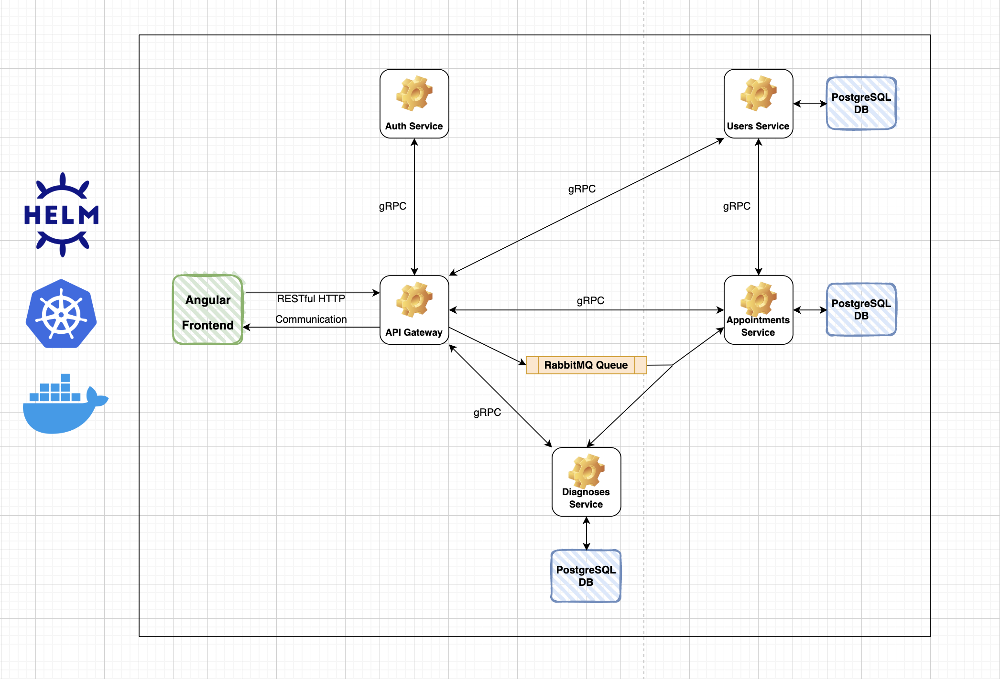

# Medical Record System

## Overview

This is a medical record system that allows doctors to manage their patients' medical records.

This project is built as a part of the "CSCB869 Java Web Services" course at the New Bulgarian University.

## Technical Overview

The project is built using the microservices architecture, and is designed to be deployed to a Kubernetes cluster,
using Docker containers and Helm.

The main services are:
 - An `Angular` frontend
 - A `Spring Boot` API Gateway
 - A `JWT` Auth service
 - An Appointments service
 - A Users service
 - A Diagnoses service

The frontend communicates with the Gateway over a `RESTful HTTP API`. Apart from the frontend, the rest of the
services communicate with each other using a combination of `gRPC` procedure calls and `RabbitMQ` messages.

Services that require data persistence use a common `PostgreSQL` server instance with independent databases inside.

## Architecture

Here is an image of what the system's architecture looks like

## Architecture Questions and Answers

### Why microservices architecture?
There is no better reason for opting for microservices, then learning purposes. A monolithic architecture would be
much more appropriate for a small-scale project like this one. My intention behind the microservices was not to
create a system optimized for scaling, but rather learn more about distributed systems in general.

### Why use different means of communication, and not stick to simple RESTful APIs?
The reasons to include multiple means of network communication are two. First, again to expose myself to new,
modern technologies with the intention of learning more about them. Two, optimize inter-service communication for
performance and end-user UX. An HTTP request that bounces from service to service might take a significant amount
of time, depending on the headers and body size. Additionally, any database IO operations that a service might need
to perform to fulfil the request will add more time overhead. To solve this, I've decided to built the
inter-service communication entirely on Remote Procedure Calls and message brokers. RPC is 5/6 times faster than
JSON, due to the binary serialization and deserialization, and message brokers allow for asynchronous events which
can trigger the parallel execution of different processes inside multiple services.

### Why use Kubernetes?
My best option would have been to use Docker Compose for defining and running multiple Docker containers for each
of the services. However, Kubernetes is the de-facto standard for deploying and orchestrating distributed systems.
The point of using a Kubernetes cluster is mainly for learning purposes. 

### Why adding Helm on top of Kubernetes?
Helm makes adding external dependencies to the cluster much easier. Installing and running a PostgreSQL database
takes only a few Helm commands. Apart from this, Helm allows for the creation of `charts` which can contain
required configurations, which allow for easily running the whole system altogether.

### Why choose Angular over React?
React is much simpler to use than Angular. For the purpose of this application, React with React Router would have
been plenty. However, Angular is much more popular for production applications at scale, thus adds more value to
learning it.

### Why use my own auth?
Proper authentication and authorization are notoriously hard to implement. Many companies use third-part tools to
ensure secure auth for their applications. Implementing my own auth brings nothing more than learning more about
it. In this particular case, the system is not going to ever be used in a production setting with real users, so
proper security is not of upmost importance. Still, to follow best practices, I have decided to set the expiration
of the JWT tokens to only 15 minutes, in order to minimize the chance of cross-site request forgery (CSRF) attacks.