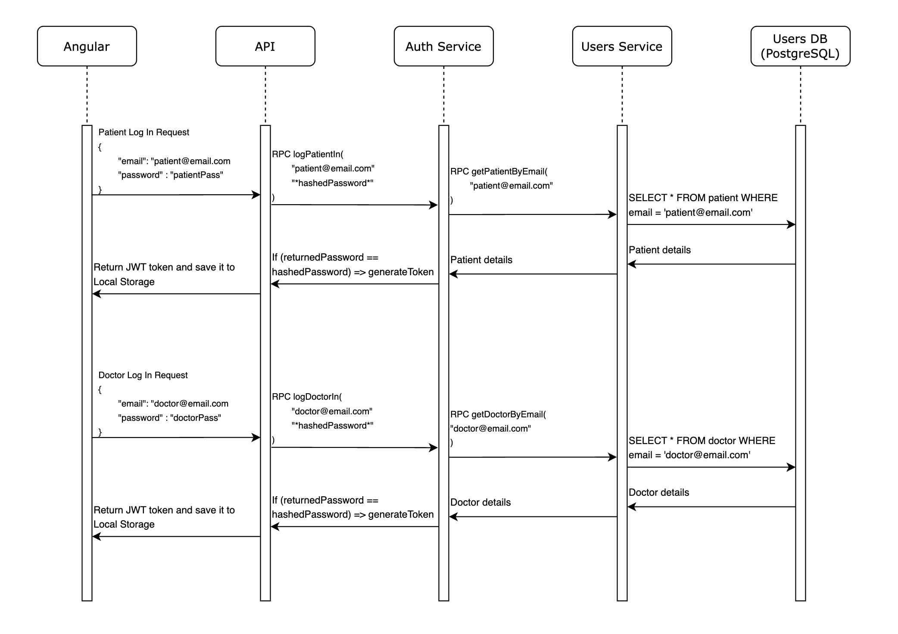

# Auth Service
The `Auth` service is a Java, gRPC server that handles `authentication` and `authorization` throughout the system using
JWT tokens.

## Sequences
### Log in Sequence
To log into the system as either a `Doctor`, or a `Patient` the system will use the following sequence to manage the
authentication of the input `email` and `password`, manage the authorization, and create a JWT token accordingly.

